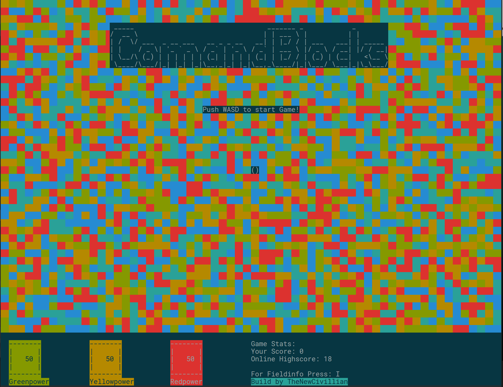
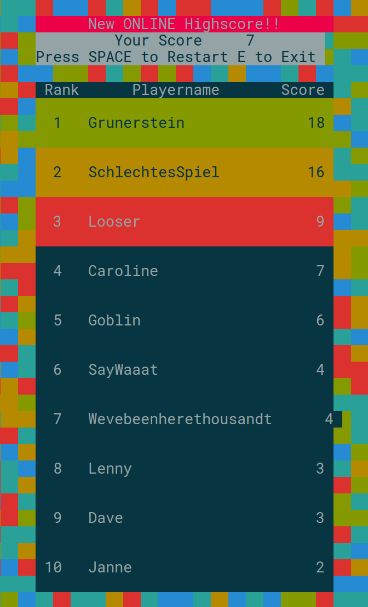

# Comandblocks Linux Port #

General
-------
An attempt to get a basic game technology running in C.  
It ended by creating Comandblocks.
Here is the new lightweight version for Linux with online highscore list!
A newer Version based on the Linux port for Windows is under development.

Install
-------
Build under Linux:

```
make
```
Buildoptions for Windows coming soon.


Screenshots
-----------
Main game frame:


Online highscore list:


